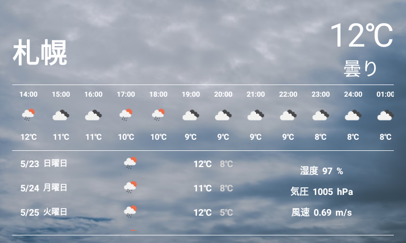

# Photom
Android Things でのスライドショー＆お天気アプリ。
通常はスライドショーが表示され、顔を検出すると天気の詳細を閲覧できる。

### 開発環境
- Android Studio 4.2.1
- Android Things 1.0.14
- NXP i.MX7D

### ライブラリ
| 名前 | バージョン | 用途 |
|:-----------|:------------|:------------|
| [kotlinx.coroutines](https://github.com/Kotlin/kotlinx.coroutines) | 1.4.1 | コルーチン |
| [WorkManager](https://developer.android.com/jetpack/androidx/releases/work?hl=ja) | 2.5.0 | 定期実行 |
| [Navigation](https://developer.android.com/jetpack/androidx/releases/navigation?hl=ja) | 2.3.5 | 画面遷移 |
| [CameraX](https://developer.android.com/jetpack/androidx/releases/camera?hl=ja) | 1.1.0-alpha04 | カメラ制御 |
| [Hilt](https://developer.android.com/jetpack/androidx/releases/hilt?hl=ja) | | DI |
| [Glide](https://github.com/bumptech/glide) | 4.11.0 | 画像読み込み＆表示 |
| [ML Kit](https://developers.google.com/ml-kit/vision/face-detection/android) | 16.0.7 | 顔検出 |
| [Cloud Firestore](https://firebase.google.com/docs/firestore/quickstart?hl=ja) | | データベース |
| [Firebase Storage](https://firebase.google.com/docs/storage/android/start?hl=ja) | | ストレージ |
| [LoopingViewPager](https://github.com/siralam/LoopingViewPager) | 1.3.1 | スライドショー |
| [Timber](https://github.com/JakeWharton/timber) | 4.7.1 | ログ出力 |
| [mockito-kotlin](https://github.com/mockito/mockito-kotlin) | 3.2.0 | モック作成 |

### デモ
Android Things のカバーはレゴブロックの互換品。カメラは右上部にセットした。カメラは常時自動しており、顔を検出すると１時間ごとや週間天気などを確認できる画面へ遷移する。遷移後は顔が検出されなければ、自動的にスライドショーに戻る。

#### Gif

### 画面
#### スクリーンショット

