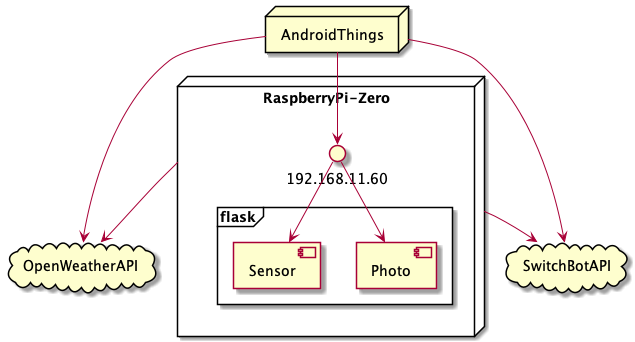

# Photom
Android Things でのスライドショーアプリ。
メニュー画面から天気の確認や Switch Bot でのデバイス制御が可能。

### 開発環境
- Android Studio Arctic Fox 2020.3.1 Patch 4
- Android Things 1.0.14
- NXP i.MX7D

### 構成

### ライブラリ
| 名前 | バージョン | 用途 |
|:-----------|:------------|:------------|
| [kotlinx.coroutines](https://github.com/Kotlin/kotlinx.coroutines) | 1.5.0 | コルーチン |
| [WorkManager](https://developer.android.com/jetpack/androidx/releases/work?hl=ja) | 2.6.0 | 定期実行 |
| [Navigation](https://developer.android.com/jetpack/androidx/releases/navigation?hl=ja) | 2.3.5 | 画面遷移 |
| [Hilt](https://developer.android.com/jetpack/androidx/releases/hilt?hl=ja) | 2.38.1 | DI |
| [Glide](https://github.com/bumptech/glide) | 4.11.0 | 画像読み込み＆表示 |
| [groupie](https://github.com/lisawray/groupie) | 2.10.0 | リスト表示 |
| [LoopingViewPager](https://github.com/siralam/LoopingViewPager) | 1.4.1 | スライドショー |
| [Timber](https://github.com/JakeWharton/timber) | 4.7.1 | ログ出力 |
| [mockito-kotlin](https://github.com/mockito/mockito-kotlin) | 3.2.0 | モック作成 |

### 画面
#### スクリーンショット

